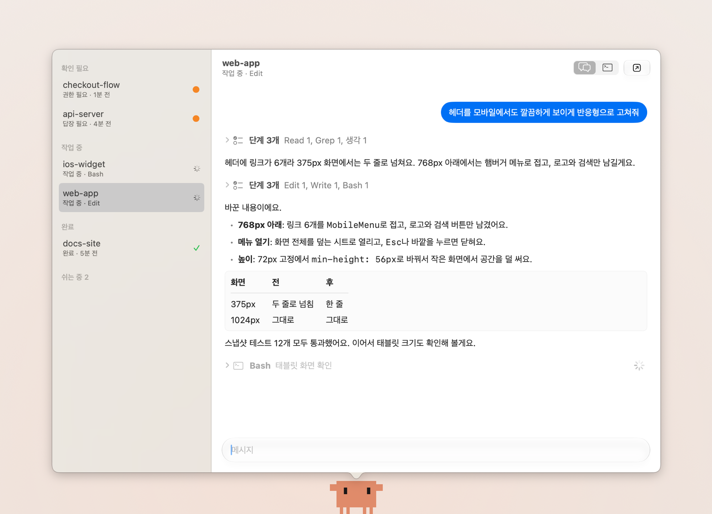
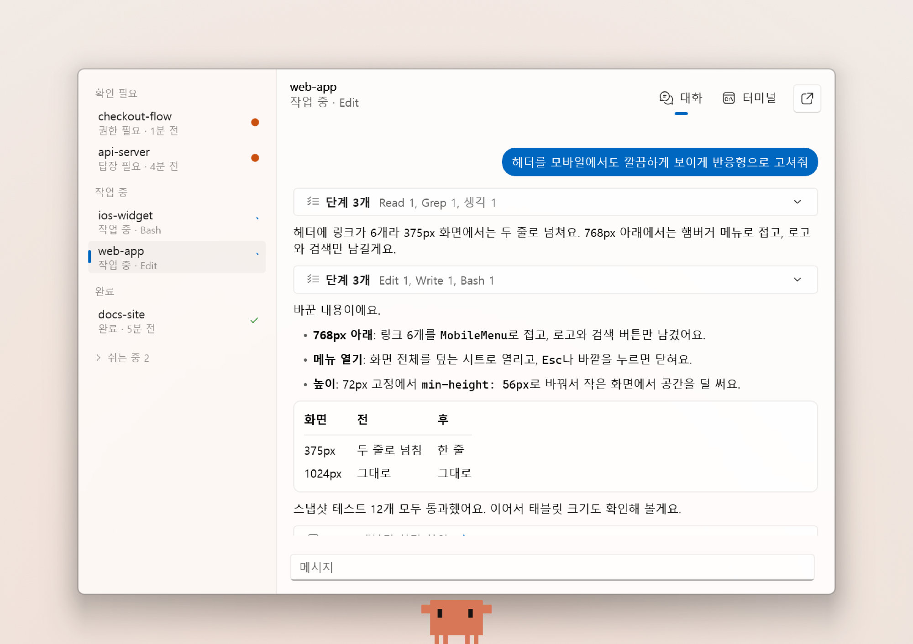
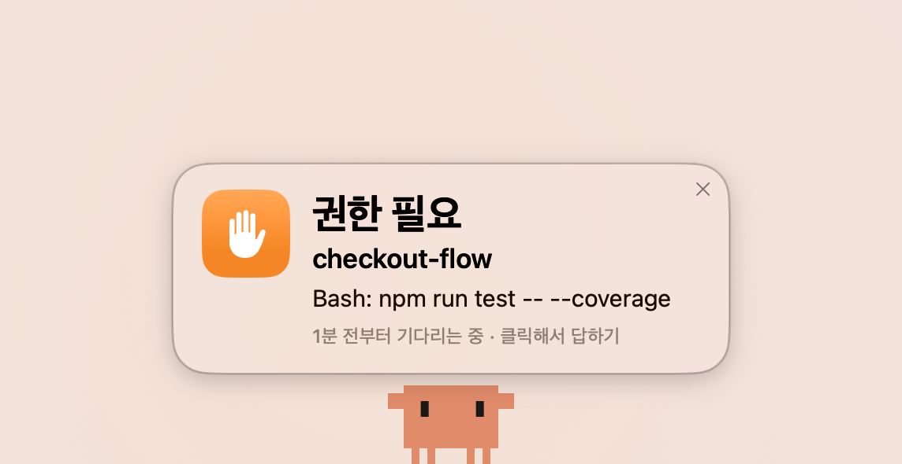
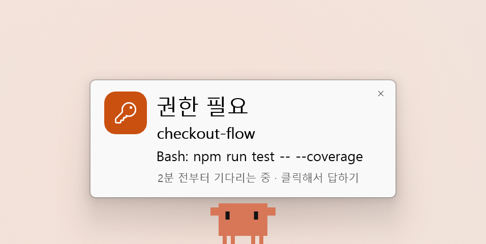

# Clawd for Orca

[English](README.md) · **한국어** · [日本語](README.ja.md) · [简体中文](README.zh-CN.md)

Clawd는 [Orca](https://www.onorca.dev)에서 실행 중인 코딩 에이전트를 지켜보는 macOS·Windows용 데스크톱 펫입니다.
에이전트가 승인이나 답변을 기다리면 화면에 카드로 알리고, Orca를 열지 않고도 그 자리에서 승인과
답변, 터미널 조작까지 할 수 있습니다.

https://github.com/user-attachments/assets/560c5ef7-bc88-408c-854e-fabffd14ca07

> **비공식 프로젝트입니다.** Anthropic, Stably AI(Orca)와 관계가 없습니다. Claude, Claude Code, Clawd는
> Anthropic의 상표이며, Orca는 Stably AI의 제품입니다.

## 왜 Clawd인가요

에이전트가 작업하는 동안 다른 일에 집중할 수 있습니다. 승인이나 답변이 필요해지면 Clawd가 화면에
카드를 띄워 알리기 때문에, 다른 작업 중에도 요청을 놓치지 않습니다.

카드를 누르면 Orca를 열지 않고 바로 승인하거나 답변할 수 있고, 에이전트의 진행 상황과 터미널도 함께
확인할 수 있습니다. 승인 버튼에서 끝나는 일반적인 알림 앱과의 차이입니다.

macOS에서는 Swift로, Windows에서는 WinUI 3로 만든 네이티브 앱입니다. Mac 앱의 다운로드 크기는 3.7 MB이며,
대기 중 CPU 사용량은 1% 안팎입니다.

## 다운로드

### macOS

[GitHub Releases](https://github.com/joonseo1227/clawd-for-orca/releases)에서 `Clawd-1.1.0-macOS.dmg`를
받아 열고, `Clawd.app`을 응용 프로그램 폴더로 끌어다 놓으면 됩니다. Apple 공증을 거친 앱입니다.

macOS 15 이상의 Apple silicon Mac과 [Orca](https://www.onorca.dev)가 필요합니다.



### Windows

[GitHub Releases](https://github.com/joonseo1227/clawd-for-orca/releases)에서 `Clawd-1.1.0-Windows-x64.msi`를
받아 실행하면 됩니다. 관리자 권한 없이 현재 사용자 계정에 설치되고 시작 메뉴에 추가됩니다. 코드 서명이
없는 설치 파일이라 SmartScreen이 확인을 요청할 수 있습니다.

x64 Windows 11과 Windows용 [Orca](https://www.onorca.dev)가 필요합니다. 설치 방법과 알려진 제한 사항은
[Windows/README.md](Windows/README.md)(영문)를 참고하세요.



## 주요 기능

- **알림 카드:** 에이전트가 승인이나 답변을 기다리면 카드로 알리고, 확인할 때까지 다시 알립니다.
- **대화창:** 에이전트를 상태별로 보여 주고, Claude Code의 작업 과정을 단계별로 표시합니다.
- **권한 승인:** 승인 요청을 버튼으로 보여 주며, 클릭 한 번(⌘1~⌘3)으로 응답할 수 있습니다.
- **답변:** 대화창에 입력한 메시지가 에이전트의 터미널로 바로 전송됩니다.
- **실시간 터미널:** Orca와 연결하면 에이전트의 터미널을 색상과 입력까지 그대로 사용할 수 있습니다.
- **파일 끌어다 놓기:** Clawd나 대화창에 파일을 놓으면 파일 경로를 보냅니다.
- **메뉴 막대, 단축키(⌃⌥J), 시스템 알림:** 알림에서 바로 답장할 수도 있습니다.

| macOS | Windows |
| :---: | :---: |
|  |  |

앱 화면은 시스템 언어에 따라 한국어 또는 영어로 표시됩니다.

## 사용법

| 조작 | 동작 |
| --- | --- |
| Clawd 또는 메뉴 막대 아이콘 클릭 | 대화창을 엽니다. 기다리는 에이전트가 있으면 먼저 보여 줍니다. |
| ⌃⌥J | 어디서든 대화창을 열거나 닫습니다. |
| ⌘1~⌘3 | 표시된 권한 요청에 응답합니다. |
| ⌘T | 대화와 터미널 화면을 전환합니다. |
| Clawd 더블클릭 | 가장 먼저 확인이 필요한 에이전트를 Orca에서 엽니다. |

Windows에서는 ⌘ 대신 Ctrl을, ⌃⌥J 대신 Ctrl+Alt+J를 사용하며, 메뉴 막대 아이콘 대신 알림 영역 아이콘을
클릭합니다.

### 실시간 터미널 연결

1. Orca 왼쪽 사이드바에서 **Orca 모바일**을 엽니다.
2. QR 코드를 만들고 **페어링 코드 복사**를 누릅니다.
3. Clawd 설정에서 실시간 터미널 옆의 **연결…**를 누르고 코드를 붙여 넣습니다.

## 업데이트

Clawd는 하루에 한 번 GitHub에서 새 버전을 확인합니다. macOS에서는 카드와 메뉴로 알려 주고, 설치는
직접 선택할 때 진행됩니다. Windows에서는 업데이트를 미리 내려받아 두었다가, Clawd를 다시 시작해
설치할지 묻습니다. 설정에서 지금 바로 확인하거나 자동 확인을 끌 수 있습니다.

## 개인정보

Clawd는 같은 컴퓨터에서 실행 중인 Orca와 통신합니다. 그 밖의 연결은 하루 한 번의 업데이트 확인뿐이며,
GitHub에서 Clawd의 릴리스 정보를 읽어 올 뿐 사용자나 에이전트에 관한 정보는 보내지 않습니다. 페어링
정보는 macOS 키체인 또는 Windows 자격 증명 관리자에만 저장됩니다.

## 직접 빌드하기

```sh
git clone https://github.com/joonseo1227/clawd-for-orca.git
cd clawd-for-orca/macOS
./build.sh --install
```

Mac 앱을 빌드하려면 Xcode 26 이상이 필요합니다. Windows 앱은 [Windows/README.md](Windows/README.md)를
참고하세요. 테스트, 서명, 동작 방식은 [CONTRIBUTING.md](CONTRIBUTING.md)에 정리되어 있습니다.

## 라이선스

[GPL-3.0](LICENSE) © 2026 joonseo1227. 코드는 자유롭게 사용, 수정, 공유할 수 있지만, 이 코드를 바탕으로
만들어 배포하는 프로그램도 소스와 함께 GPL-3.0으로 공개해야 합니다. 라이선스는 위 상표에 적용되지
않으며, [`macOS/Sources/Sprite.swift`](macOS/Sources/Sprite.swift)에 그려진 Clawd 캐릭터는 Anthropic에
속합니다.
