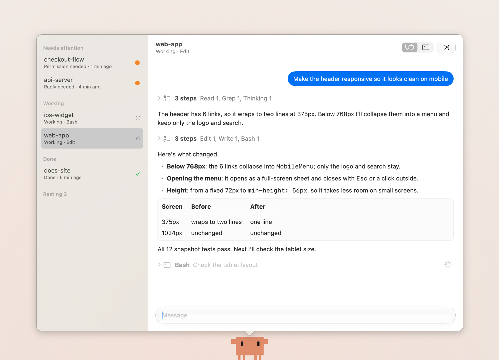
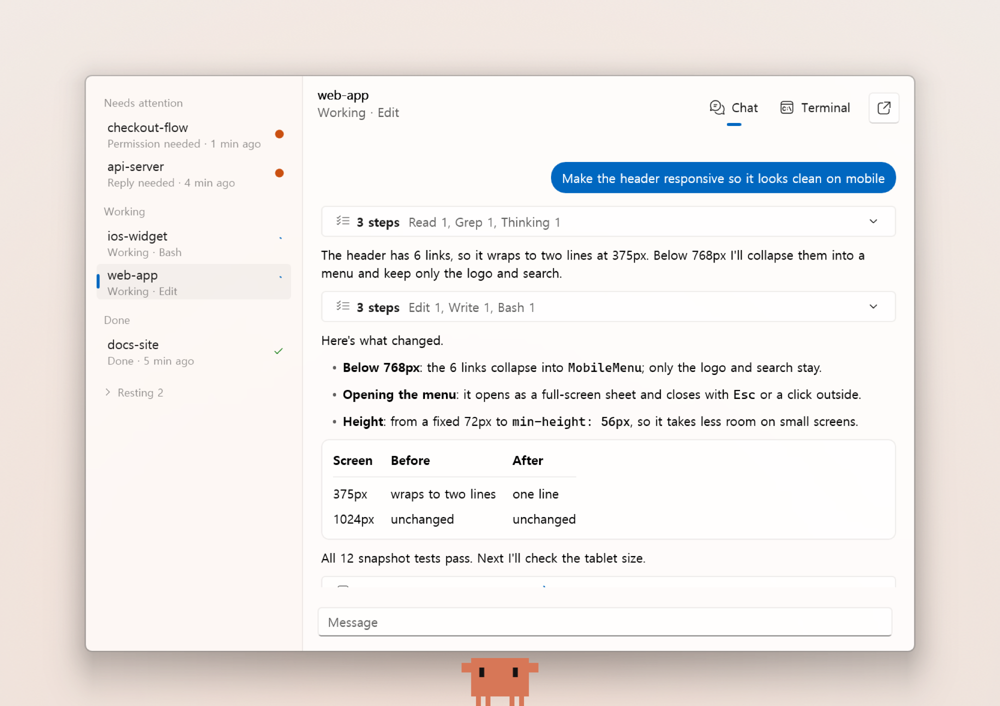
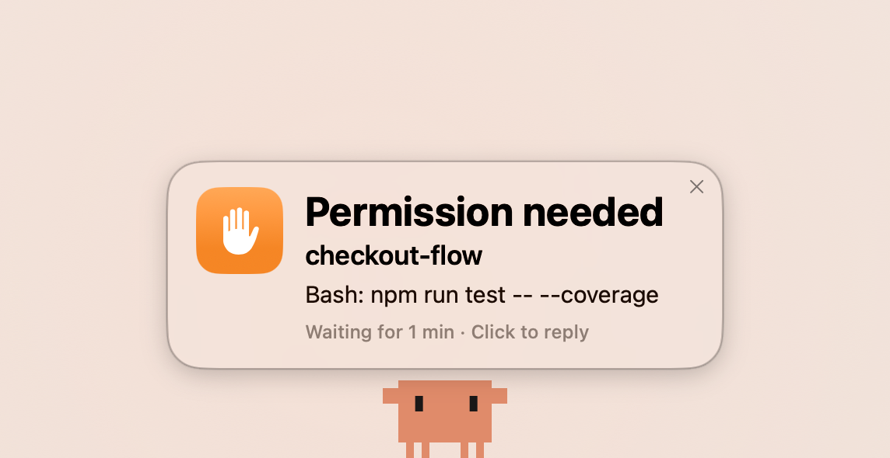
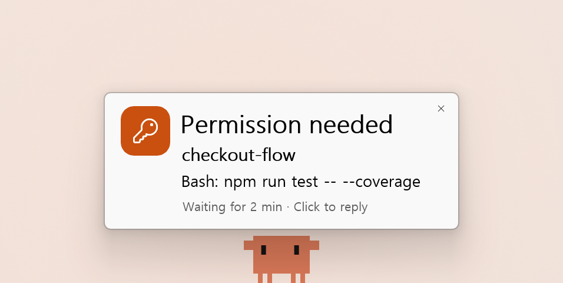

# Clawd for Orca

**English** · [한국어](README.ko.md) · [日本語](README.ja.md) · [简体中文](README.zh-CN.md)

Clawd is a desktop pet for macOS and Windows that monitors the coding agents running in
[Orca](https://www.onorca.dev). When an agent is waiting for your approval or an answer, Clawd
shows a card on screen, and you can approve, reply and work in the agent's terminal without
opening Orca.

https://github.com/user-attachments/assets/1c0bdd06-f9ae-479c-bc65-6bfe3ec750a1

> **Unofficial project.** Clawd is not affiliated with Anthropic or Stably AI (Orca). Claude,
> Claude Code and Clawd are trademarks of Anthropic, and Orca is a product of Stably AI.

## Why Clawd

While your agents work, you can focus on other things. When an agent needs your approval or an
answer, Clawd shows a card on screen, so no request goes unnoticed.

From that card you can approve or answer without opening Orca, and check the agent's progress and
terminal in the same place. This goes beyond notification apps that stop at an approve button.

Clawd is a native app on each platform, built with Swift on macOS and WinUI 3 on Windows. The Mac
app is a 3.7 MB download and uses about 1% CPU when idle.

## Download

### macOS

Download `Clawd-1.1.0-macOS.dmg` from [GitHub Releases](https://github.com/joonseo1227/clawd-for-orca/releases), open it
and drag `Clawd.app` to the Applications folder. The app is notarized by Apple.

Requires an Apple silicon Mac with macOS 15 or later, and [Orca](https://www.onorca.dev).



### Windows

Download `Clawd-1.1.0-Windows-x64.msi` from [GitHub Releases](https://github.com/joonseo1227/clawd-for-orca/releases)
and run it. Clawd installs for your account without an administrator prompt and appears in the
Start menu. The installer is not code-signed, so SmartScreen may ask you to confirm it.

Requires Windows 11 on x64, and [Orca](https://www.onorca.dev) for Windows. See
[Windows/README.md](Windows/README.md) for setup and known limitations.



## Features

- **Alert cards** when an agent needs your approval or an answer, with a reminder until you respond.
- **Chat** that lists your agents by status and shows Claude Code's progress step by step.
- **Permission answers** as buttons, so you can approve or deny with one click (⌘1 to ⌘3).
- **Replies** typed in the chat go straight to the agent's terminal.
- **Live terminal** of each agent, with colors and input, after connecting to Orca.
- **Drag and drop** files onto Clawd or the chat to send their paths.
- **Menu bar icon, global shortcut (⌃⌥J) and system notifications** with inline reply.

| macOS | Windows |
| :---: | :---: |
|  |  |

The app is available in English and Korean and follows the system language.

## Usage

| Action | Result |
| --- | --- |
| Click Clawd or the menu bar icon | Opens the chat, starting with any agent that is waiting. |
| ⌃⌥J | Opens or closes the chat from anywhere. |
| ⌘1 to ⌘3 | Answers the permission request on screen. |
| ⌘T | Switches between the chat and the terminal. |
| Double-click Clawd | Opens the agent that needs you most in Orca. |

On Windows, use Ctrl in place of ⌘, Ctrl+Alt+J in place of ⌃⌥J, and the notification-area icon
in place of the menu bar icon.

### Connecting the live terminal

1. In Orca, open **Orca Mobile** from the left sidebar.
2. Create the QR code and click **Copy pairing code**.
3. In Clawd's Settings, click **Pair…** next to the live terminal and paste the code.

## Updates

Clawd checks GitHub for a new version once a day. On macOS it tells you on a card and in its menu,
and installs the update when you choose to. On Windows it downloads the update in the background,
then asks you to restart Clawd to install it. In Settings you can check now or turn automatic
checks off.

## Privacy

Clawd works with Orca running on the same computer. Its only other connection is the daily update
check, which reads Clawd's releases from GitHub and sends nothing about you or your agents. The
pairing code is stored only in the macOS Keychain or the Windows Credential Manager.

## Building from source

```sh
git clone https://github.com/joonseo1227/clawd-for-orca.git
cd clawd-for-orca/macOS
./build.sh --install
```

Building the Mac app requires Xcode 26 or later. For the Windows app, see
[Windows/README.md](Windows/README.md). [CONTRIBUTING.md](CONTRIBUTING.md) covers tests, signing and
how Clawd works.

## License

[GPL-3.0](LICENSE) © 2026 joonseo1227. You may use, modify and share the code, but any program you
distribute that is based on it must also be released under the GPL-3.0 with its source code. The
license does not cover the trademarks above; the Clawd character, drawn in
[`macOS/Sources/Sprite.swift`](macOS/Sources/Sprite.swift), belongs to Anthropic.
